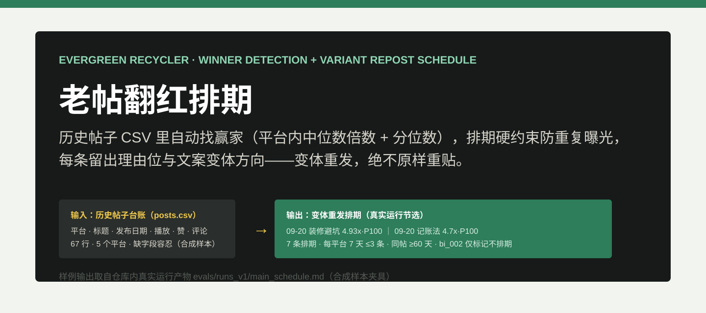
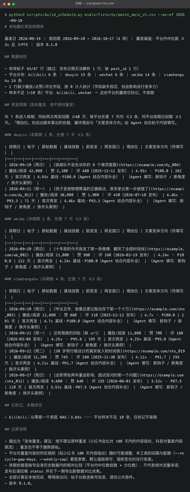
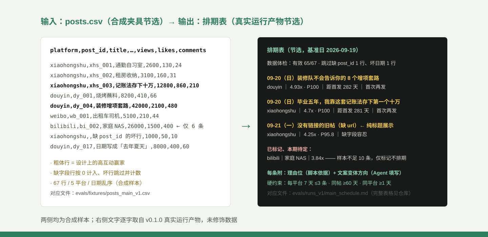
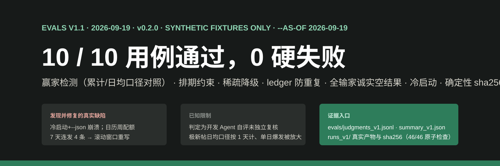

# 老帖翻红排期 evergreen-recycler

  

老帖翻红排期工具：从历史帖子数据里挑出赢家内容，生成再发排期和每条的文案变体建议。
把创作者后台导出的帖子台账交给它，它会先给数据做体检，再用"平台内中位数倍数 + 分位数"
找出真正跑赢你自己基线的老帖，排出遵守平台节奏的再发计划——每条都留出"为什么是它"
的理由位和"文案变体方向"空栏。全部本地计算，零网络、不要平台授权，输出是
**变体重发建议，绝不建议原样重发**。

下面是一次真实运行的终端截图（合成样本夹具，基准日 2026-09-19，v0.1.0 录制；
v0.2.0 默认口径的排期结论与其一致，仅新增口径标注与版本号）：67 行数据体检、
7 条赢家排期、1 条稀疏平台帖子仅标记不排期，全部逐字来自终端输出：

  

## 使用场景

这个工具用在博主**复盘旧内容、规划再发布**的三个时刻：

| 场景 | 你是谁 | 什么时候用 | 排期表帮你干什么 |
| --- | --- | --- | --- |
| 月度翻红盘点 | 个人博主 / 小团队 | 每月导一次后台数据，想翻几条旧帖给新号续流量 | 自动挑出跑赢自己基线 3 倍以上的赢家，按"每平台每周 ≤3 条"排好日期，不用凭感觉翻 |
| 多平台错峰再发 | 同时经营小红书/抖音/微博的博主 | 手动翻红总撞车，同一天连发被限流 | 每平台错开排期日，同帖两次再发强制隔 60 天以上，台账记一次就不怕重发 |
| 接手旧号 / 买号复盘 | 接手别人账号的运营 | 拿到一份历史导出，不知道哪些旧选题值得重做 | 先看数据体检和赢家清单，老帖的"常青选题"一目了然，变体方向直接可抄 |

不适合的场景：追热点的时效内容（它只看历史基线）、粉丝增长诊断、竞品分析——
它只做"赢家检测 + 再发排期 + 变体建议"这一件事。

## 它解决什么问题

旧内容承载着账号的大部分流量：HubSpot 官方博客分析过，**76% 的月浏览量来自旧帖**
（后续口径约 89%），92% 的线索来自旧帖。而"把好旧帖再发一次"这件事，海外已经有人
把它做成了付费核心功能——CoSchedule 的 ReQueue 从 **$29/月（年付）的入门档就开始
内置**，Suite 档到 $69/月以上，还必须把社交账号 OAuth 授权绑到他家日历、X 账号
按 $16/账号/月另付；G2/Capterra 上最高频的差评就是"贵"。小红书/抖音/公众号没有
开放给这些海外工具的发布 API，国内博主的"翻红"全靠手工，最常见的手法恰恰是
"删了重发"——这正是被平台判重复限流的高危动作。

本仓库只做那一步：**赢家检测 vs 再发排期 vs 每条的变体方向**。输入是你自己导出的
CSV 台账（不用授权任何账号），输出是排期表和 CSV，发布仍由你人工完成。

  

上图取自仓库内真实运行产物（[输入夹具](evals/fixtures/posts_main_v1.csv) →
[排期表](evals/runs_v1/main_schedule.md)，人工构造的合成样本）：赢家逐条给出
基线倍数与分位数、缺字段的赢家降级为纯标题展示、稀疏平台的帖子明确"仅标记不排期"。

## 能力与边界

| 能力 | 边界 |
| --- | --- |
| 赢家检测：互动量对比**平台内中位数 ≥3x 且 ≥P75**，附倍数与分位数可复核；口径可选**累计互动量**（`--metric total`，默认，与 v0.1.0 一致）或**日均互动量**（`--metric per_day`，互动量 ÷ max(存活天数, 1)，修正老帖的累计优势），报告与 CSV 标注所用口径 | 只和账号自己的历史比，不是流量承诺；发布不到 1 天的极新帖按 1 天计、单日爆发会被日均口径放大；播放/赞/评的权重可调，口径见[字段文档](references/排期规则与字段.md) |
| 排期硬约束：每平台任意 7 天 ≤3 条、同帖再发 ≥60 天、同平台排期日 ≥1 天，全参数化 | 平台对重复内容的判定规则（如小红书 180 天内容指纹）是黑盒且**随时可能调整**，间隔与配额默认取保守值，规则变化时需自行收紧 |
| 样本不足自动降级：平台 <10 条仅标记不排期；总帖 <20 条只给"先攒数据"建议 | 降级是保守而非缺陷——小样本上的分位数不可信 |
| ledger 台账防重复：读过再发记录就不会把同一帖排进 60 天内 | ledger 由博主回填维护，不回填就不知道历史 |
| 每条排期留理由位与文案变体方向空栏，Agent 按帖填写 | 变体方向是建议，发布前后悔了没有任何自动兜底 |

红线写在排期表每一页里：**输出是「变体重发」建议，绝不建议原样重发**——小红书会比对
同账号 180 天内笔记的内容指纹，抖音对重复内容限流；**重发也不等于删除原帖**，
删帖重发反而会被二次判重。

## 如何安装与使用

把本仓库放入你的 Agent 技能目录，然后直接对 Agent 说：

> "这是我从创作者后台导出的帖子数据，帮我挑出值得翻红的老帖，排一份下个月的再发计划，
> 每条告诉我为什么是它、文案怎么改。"

Agent 会让脚本先做数据体检（缺哪些列、多少坏行、各平台样本够不够），再做赢家检测和
排期，然后逐条解释"为什么是它"并填写 1-3 个文案变体方向；样本太少的平台它会明确
说"先攒数据"而不是硬排。发布后把结果回填到台账，下一轮运行自动避开 60 天内的重复。

输入只需要一份历史帖子 CSV（平台、标题、发布日期、播放/赞/评论；常见中文列名自动
映射，缺字段可容忍）。也可以只用命令行脚本，参数、退出码与 ledger 格式见
[维护文档](docs/usage.md)。

## 评测结果

V1.1 评测（2026-09-19，v0.2.0，全部使用合成夹具、固定基准日 2026-09-19）：
**10/10 用例通过，0 硬失败，46/46 原子检查通过，20/20 单元测试通过**。覆盖赢家检测
（排期是否恰好落在设计的高互动帖上，含**累计/日均两种口径各选出不同赢家**的对照
用例）、排期约束复算、稀疏平台降级、ledger 防重复、全输家账号的诚实空结果、
冷启动建议、确定性（两次运行 sha256 一致）、缺字段容忍与变体红线十类行为。
默认口径 total 与 v0.1.0 结论一致；v0.1.0 首轮为 9 用例 32 项原子检查的记录
（该数字当时误写，实际 41 项，已在迭代记录中核算修正）。

  

- 逐题判断：[judgments_v1.jsonl](evals/judgments_v1.jsonl)；汇总：[summary_v1.json](evals/summary_v1.json)
- 真实产物与哈希：[evals/runs_v1/](evals/runs_v1/)（含口径对照夹具的 total/per_day 两跑）
- **诚实披露**：开发期单元测试抓到两个真实缺陷（冷启动加 JSON 汇总会崩溃；周配额按
  日历周计数导致 7 天连发 4 条，已改为滚动 7 天窗口）；首轮评测还发现"缺 url 行纯标题
  展示"无证据覆盖，通过校准夹具后复跑通过，过程见[迭代记录](evals/iteration_notes.md)；
  判定为开发 Agent 自评（model_only），尚未独立人工复核。评测验证的是"赢家落在
  设计的高互动帖上"，不等于真实账号上的翻红效果——那需要发布后的回流数据。

## 对标与定位

与 CoSchedule ReQueue、ContentStudio Evergreen、SmarterQueue 的排期规则对比，
以及 Postiz（36k star 的开源排期 SaaS，重复间隔上限仅 1 个月、无比对历史数据的
赢家检测）和国内上传工具的定位差异，见[对标文档](references/benchmarks.md)。
一句话定位：付费工具验证了"常青回收"值得单独付钱，但它们要订阅费加 OAuth 绑定，
且赢家全靠手动标记；本仓库本地检测赢家、参数化排期、只建议变体重发。

需求来源：自媒体需求雷达对公开信号的研究（problem_key `evergreen-recycler`，
雷达仓库 `medical-selfmedia-demand-radar`）。

## 社区与许可

- 社区讨论：[LINUX DO](https://linux.do)
- 许可证：Apache License 2.0（见 [LICENSE](LICENSE)，第三方素材说明见 [NOTICE](NOTICE)）
